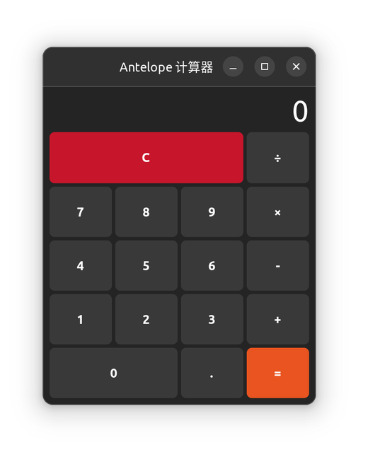
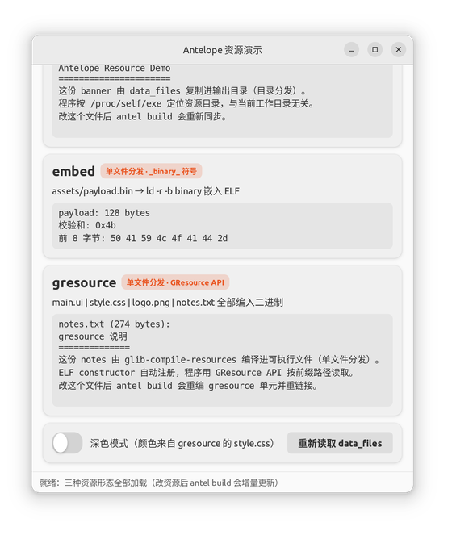

# 示例与效果图

仓库自带的示例工程都在 `demos/` 下，都是真实可构建、可运行的项目。下面的效果图与配置一一对应，照抄即可复现。

## gtkcalc：GTK 计算器（`pkg_config` 集成）

位置：`demos/gtkcalc/`。一个用 libadwaita（GTK 4）写的计算器，演示最常见的图形项目形态：**GUI + 外部库**。它不手写任何 `-I`/`-l`，全靠 `pkg_config` 注入。



**antel.json**（`demos/gtkcalc/antel.json`）：

```json
{
    "projectName": "gtkcalc",
    "target_type": "exe",
    "compiler": "gxx",
    "source": [
        "main.c"
    ],
    "exclude_source": [],
    "include_directories": [],
    "compile_args": [
        "-O2",
        "-Wall"
    ],
    "link_args": [],
    "report": false,
    "pkg_config": [
        "libadwaita-1"
    ]
}
```

**配置要点**：

- `pkg_config: ["libadwaita-1"]`：构建时 antel 自动执行 `pkg-config --cflags/--libs libadwaita-1`，把 `-I/usr/include/libadwaita-1` 等编译参数注入每个编译单元，把 `-ladwaita-1 -lgtk-4 ...` 追加到链接命令末尾。装好 libadwaita 开发包后一行配置就能编
- 装依赖（Ubuntu 22.04）：

  ```bash
  sudo apt install libadwaita-1-dev
  ```

- 构建与运行：

  ```bash
  cd demos/gtkcalc
  antel rebuild
  ./gtkcalc_antel/gtkcalc
  ```

- 程序还带了 `--auto-close N`（秒）参数用于无人值守验证，例如 CI 里 `./gtkcalc_antel/gtkcalc --auto-close 3` 会打开窗口 3 秒后自行退出

!!! note "libadwaita 1.1 的几个 API 约束（代码已适配）"
    这套 demo 按 Ubuntu 22.04 自带的 libadwaita 1.1 / GTK 4.6 编写，有三个新手容易踩的点，源码里都有注释：

    1. `AdwApplicationWindow` **没有标题栏区域**——窗口按钮（关闭/最小化/最大化）来自内容顶部的 `AdwHeaderBar`，调 `gtk_window_set_titlebar` 会被 libadwaita 拒绝并崩溃；
    2. 内容必须用 `adw_application_window_set_content` 设置，`gtk_window_set_child` 同样被拒绝；
    3. `g_application_run` 会解析并拒绝未知命令行选项，自定义参数（如 `--auto-close`）要先从 argv 里剥掉。

## resdemo：运行资源打包（`data_files` / `gresource` / `embed`）

位置：`demos/resdemo/`。一个程序同时用三种形态携带资源，界面本身也由资源驱动，用来演示完整的资源分发方案：

- **data_files —— 目录分发**：`assets/` 复制进输出目录，可替换；程序按 `/proc/self/exe` 定位（与当前工作目录无关）
- **gresource —— 单文件分发**：整个界面（`main.ui`）、样式（`style.css`）、图标（`logo.png`）、文本（`notes.txt`）全部编译进可执行文件，GtkBuilder / CSS provider 直接按资源路径加载
- **embed —— 单文件分发**：`assets/payload.bin` 经 `ld -r -b binary` 嵌入 ELF，程序用 `_binary_` 符号访问



**antel.json**（`demos/resdemo/antel.json`）：

```json
{
    "projectName": "resdemo",
    "target_type": "exe",
    "compiler": "gxx",
    "source": [
        "src/main.c"
    ],
    "exclude_source": [],
    "include_directories": [],
    "compile_args": [
        "-O2",
        "-Wall"
    ],
    "link_args": [],
    "report": false,
    "pkg_config": [
        "libadwaita-1"
    ],
    "data_files": [
        "assets"
    ],
    "gresource": "gresource.gresource.xml",
    "embed": [
        "assets/payload.bin"
    ]
}
```

**配套文件结构**：

```text
demos/resdemo/
├── antel.json                 # 上面的配置
├── gresource.gresource.xml    # gresource 清单（prefix 与文件别名）
├── assets/
│   ├── banner.txt             # data_files 复制；gresource XML 里未引用
│   ├── logo.png               # gresource 引用，同时也会被 data_files 复制（无妨）
│   └── payload.bin            # embed 嵌入；gresource XML 里未引用
├── data/
│   ├── ui/main.ui             # GtkBuilder 界面描述（gresource 引用）
│   ├── css/style.css          # 界面样式（gresource 引用）
│   └── share/notes.txt        # 运行期读取的文本（gresource 引用）
└── src/main.c                 # 三种形态的读取代码
```

**gresource.gresource.xml**：

```xml
<?xml version="1.0" encoding="UTF-8"?>
<gresources>
  <gresource prefix="/com/antelope/demo">
    <file alias="ui/main.ui">data/ui/main.ui</file>
    <file alias="css/style.css">data/css/style.css</file>
    <file alias="img/logo.png">assets/logo.png</file>
    <file alias="share/notes.txt">data/share/notes.txt</file>
  </gresource>
</gresources>
```

**三种形态的取舍**：

| 形态 | 分发形态 | 适合 | 程序侧访问 |
| --- | --- | --- | --- |
| `data_files` | 目录（资源在可执行文件旁边） | 可替换、体积大、要热更新的资源 | 普通文件读取（相对 `/proc/self/exe` 定位） |
| `gresource` | 单文件（编进二进制） | GTK/GLib 工程的界面、样式、图标、文本 | `g_resources_lookup_data` / `gtk_builder_new_from_resource` |
| `embed` | 单文件（编进二进制） | 任意二进制：固件、字体、按键映射、配置文件 | `_binary_<路径转下划线>_start/_end/_size` 符号 |

**增量行为**（这也是写进测试里的契约）：

- 改 `assets/banner.txt` → `antel build` 重新同步拷贝
- 改 `assets/payload.bin` → 没有任何编译单元变 stale，但**资源变化会驱动重链接**，程序内嵌内容跟着更新
- 改 `data/css/style.css` 或 `data/share/notes.txt` → gresource 源重新生成 → 重编 gresource 单元 → 重链接

**构建与运行**：

```bash
cd demos/resdemo
antel rebuild
./resdemo_antel/resdemo
```

窗口内左下角的开关切换深色/浅色主题（颜色来自 gresource 编进去的 `style.css`），右侧按钮重新从磁盘读取 `data_files` 的 banner——两个交互都演示「改资源 → build → 界面跟着变」。

### 日志与构建产物分析

构建时每个环节都会落盘一份可复核的产物，`antel analyze` 把这些数据汇总成一页可视化报告。这是 resdemo 构建后 `demos/resdemo/resdemo_antel/log/` 下的实际内容：

| 文件 | 内容 |
| --- | --- |
| `resdemo.gxx` | 本次执行的完整编译命令（gcc ... `-I/usr/include/libadwaita-1` ... `-o resdemo_antel/obj/src_main.o`） |
| `resdemo.make` | 走 make 后端时的完整输出（实际编译是否跳过/重编） |
| `antel.mk` | 内部规则文件（生成物勿改；手工 `make -f` 可复现同一次编译） |
| `resdemo_link.sh` | 链接脚本，链接就是执行这个脚本——能提前看到 `-ladwaita-1 -lgtk-4 ...` 全部库依赖 |
| `linkInfor` | 链接过程的完整输出，链接失败时的第一现场 |
| `hashes` | hash 基线，记录上次成功构建的全部输入文件与 md5 |
| `report.html` | `antel analyze` 生成的可视化分析报告（自包含单文件，浏览器打开） |

**用报告逐项核对 resdemo**（`antel analyze` 后打开 `resdemo_antel/report.html`）：

- **资源情况**：展开到文件级——10 个资源文件，`data_files` 3 项（banner.txt/logo.png/payload.bin 的类型与大小）、`gresource` 6 项（XML + main.ui/style.css/logo.png/notes.txt + 生成的 `gresource.c` 142.3 KB）、`embed` 1 项（payload.bin 128 B + `_binary_assets_payload_bin` 符号）；每种资源带 ✓ 已复制/已编入/已嵌入状态
- **目标符号表**：98 个符号按 nm 类型分类（函数/数据/BSS/未定义引用），`t exec_dir`、`T main` 等每个符号一个独立 chip
- **编译参数统计**：`-O2×2  -Wall×2`（配合 -I 头文件路径），一眼确认优化级别与警告开关
- **动态依赖**：NEEDED 列出 `libadwaita-1.so.0 libgtk-4.so.1 libgio-2.0.so.0 ...`，下面是 ldd 完整解析（每条含地址与路径）
- **增量状态**：hash 基线是否存在、本次变化文件、待重编清单——与 `log/hashes`、`log/hashes_diff`、`log/stale_files` 一一对应
- **头文件依赖**：从 `obj/*.o.d` 反推 `src/main.c` 依赖的头文件

**排查路径**：改坏代码 → `antel rebuild` 失败 → 先看 `log/<项目名>.gxx` 的编译命令、再看 `report.html` 的诊断汇总；链接失败 → `log/linkInfor` + 链接脚本；怀疑增量判断 → `log/hashes_diff` 与 `log/stale_files`。所有数据都是真实工具（`file`/`nm`/`readelf`/`ldd`/`gcov`）的输出，可直接复核。

!!! note "为什么能放心走增量"
    `glib-compile-resources` 对同样的输入生成**逐字节相同**的输出（已实测），因此 gresource 源可以安全进入 antel 的 hash 基线；`ld -r -b binary` 的符号命名是确定的规则：`assets/payload.bin` → `_binary_assets_payload_bin_start/_end/_size`（路径里非字母数字字符全部换成下划线）。这两条是设计文档（DESIGN.md）与测试里明确的契约。

## antelstats：共享库与消费者

位置：`demos/antelstats/`。一个统计分析小工具：共享库 `libantelstats` 提供均值/标准差/中位数等统计函数，可执行程序调用它打印报表。**只用了两个配置文件**——库的生产形态与可执行程序的消费形态——没有其他花活；示例数据直接写死在 `main.c` 里，运行不需要任何外部文件。

```text
demos/antelstats/
├── antel.json    # 版本化共享库 libantelstats.so.1.0.0（多文件：stats/csv/version）
├── app.json      # 可执行程序：按 soname 链接库，rpath 加载运行
└── src/          # antelstats.h / stats.c / csv.c / version.c / main.c
```

**antel.json**（版本化共享库）：

```json
{
    "projectName": "antelstats",
    "target_type": "shared",
    "compiler": "gxx",
    "source": ["src/stats.c", "src/csv.c", "src/version.c"],
    "include_directories": ["src"],
    "compile_args": ["-O2", "-Wall", "-fPIC"],
    "report": false,
    "version": "1.0.0"
}
```

构建后输出目录里是：`libantelstats.so.1.0.0`（真实文件）+ `libantelstats.so.1`、`libantelstats.so` 两条软链；`readelf -d` 显示 `SONAME = libantelstats.so.1`。

**app.json**（可执行消费者，按 soname 链接与加载）：

```json
{
    "projectName": "app",
    "target_type": "exe",
    "compiler": "gxx",
    "source": ["src/main.c"],
    "compile_args": ["-O2", "-Wall", "-Isrc"],
    "link_args": ["-Lantelstats_antel", "-lantelstats"],
    "report": false,
    "rpath": ["$ORIGIN/../antelstats_antel"]
}
```

要点：`include_directories` 里的 `.c` 会参与构建（这是设计），所以依赖库的工程**只用 `-I` 拿头文件、不要 `include_directories` 指进库源码目录**，否则库会被静态重编一遍。`rpath` 的 `$ORIGIN` 运行期展开为可执行文件目录，因此 `ldd` 显示的是按 SONAME 加载：

```text
libantelstats.so.1 => .../antelstats_antel/libantelstats.so.1
```

构建与运行（两行命令，无外部输入）：

```bash
cd demos/antelstats
antel rebuild                 # 版本化共享库 + 软链
antel rebuild -f app && ./app_app/app          # 内嵌数据直接出统计报表
antel analyze -f app          # 生成可视化报告 app_app/report.html
```

!!! note "sanitize / coverage 怎么用"
    本 demo 没有为它们做独立配置——因为它们就是 `antel.json` 里的一两行开关，测试（`tests/test_sanitize_coverage.py`）已经覆盖。需要时在任意配置里加 `"sanitize": ["address"]`（调试内存问题记得配合 `-O0 -g`，`-O1` 以上 GCC 会把未定义的越界访问优化掉、ASan 检测不到）或 `"coverage": true`（运行后 `gcov` 出报告）即可。

!!! tip "可视化分析报告"
    `antel analyze` 在输出目录生成自包含的 `report.html`——10 个分析维度：产物、增量状态、编译参数统计、资源情况、目标符号表、头文件依赖、大小分布、动态依赖、编译命令、日志清单，浏览器直接打开即可看。详见[命令参考](commands.md)。